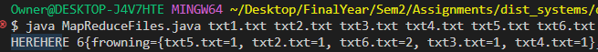

# dist-systems-assignment-2
Brian Moyles - 21333461
Dave Szczesny - 

# Proof It cant Read in multiple files 
- Added a Test Variable to track the number of args
```
    int i = 0;
    for (String file : args) {
    i++;
    input.put(file, readFile(file));
    }
    System.out.printf("HEREHERE %d", i);
```


Note: HEREHERE was used as every word is printed in the terminal making it hard to track