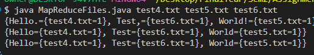

# dist-systems-assignment-2
Brian Moyles - 21333461
Dave Szczesny - 21300293

# How to run

There are two separate ways to run this program for convenience
There is a file called `MapReduceFiles.java` which contains the whole source code in the one file.
A refactored version of the program exists in the `src/` directory.

## Option 1 - Running MapReduceFiles.java
To run the MapReduceFiles.java program use the following command
```sh
java MapReduceFiles.java <text file list>
```
Where the text file list is the list of text files that the user wants to use. 3 must be given.


## Option 2 - Running Refactored Version

To run the refactored version follow the following instructions

Run the following comman to build the java project
```sh
sh build.sh
```

To then run the java program run the following command
```sh
sh run.sh text1.txt text2.txt text3.txt
```
text.txt are the text files to be used in the program. Please note that 3 must be provided.

## Running the Original File
It is also possible to run the original file "sample program".
```sh
sh run_orginal.sh
```

# Part 1 - Proof It cant Read in multiple files 
- Added a Test Variable to track the number of args
```
    int i = 0;
    for (String file : args) {
    i++;
    input.put(file, readFile(file));
    }
    System.out.printf("HEREHERE %d", i);
```


Note: HEREHERE was used as every word is printed in the terminal making it hard to track

# Part 2 - Timing 
- Timing was added to different parts of the file in various important places
- The time was captured at the start and end of parts, thus allowing us to calculate the time taken
- Timings ArrayList was used to store all the values then write them to a file at the end using a new function
- Example:
    ```
        long mapStart = System.currentTimeMillis();
        ... Map Functionality ...
        long mapEnd = System.currentTimeMillis();
        timings.add("Map Time: " + (mapEnd - mapStart) + " ms");
    ```
- Results for running with 10 txt files:
    ```
    File Read Time: 326 ms
    Brute Force Time: 471 ms
    Map Time: 434 ms
    Group Time: 198 ms
    Reduce Time: 110 ms
    Distributed Map Time: 131 ms
    Distributed Group Time: 134 ms
    Distributed Reduce Time: 5982 ms
    Distributed Total Time: 6249 ms
    Total Execution Time: 12389 ms
    ```

# Part 3 

The chunk size is dynamically determined at run time using the following formula. min{(C_{max},max(C_{min},L / 10))}
For example given 20,000 lines of text the chosen chunk size would be 2,000 per thread.
There was also a modification to the specification in part 3. 
Looking at the text files chosen for this assignment we noticed that none of the files exceeded 80 characters per line. This was modified to be 70 characters.


# Part 4 - Regex
- Simple Regex was used to remove any punctuation from the end of words, so that only the word is returned
- Example was run with 3 test files with test words for easy-to-read proof that the functionality works 
- The 3 files contained a word each with punctuation at the end:

- As can be seen from the output, once the map function is used, it removes the punctuation


# Part 5

The number of words per batch was determined using a dynamic function given by the following formula.
min(max(B_{min},W / 10),B_{max})